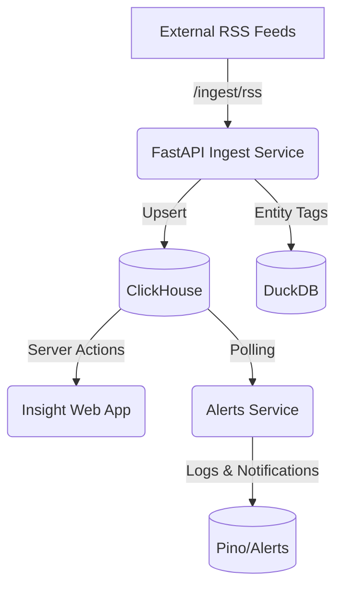

# Phase 3 — Omnisonic Insight

## Overview
Phase 3 brings cross-genre news & analytics to the Omnisonic ecosystem. The goal is to ingest heterogeneous news feeds, normalize them, tag relevant entities (artist, work, recording), and surface actionable trends via dashboards and alerts.

## Data Flow


### Components
- **Ingest Service (`services/ingest`)**  
  - `/ingest/isrc` normalizes track metadata and upserts to Graph API (Postgres).  
  - `/ingest/rss` fetches RSS feeds, writes normalized items to ClickHouse, tags entities via heuristics, and captures backup records in DuckDB.
- **Tagging Module**  
  - Uses stoplists and fuzzy matching against known artists/works/recordings.
- **ClickHouse**  
  - `news_items`: Raw news entries.  
  - `entity_links`: Many-to-one rows linking news to tagged entities.  
  - `news_items_last7` view: Last 7 days per source.
- **Insight Web (`apps/insight-web`)**  
  - Server action queries ClickHouse to show 7-day trending entities.
- **Alerts Service (`services/alerts`)**  
  - Polls ClickHouse every minute, logs threshold crossings (entity mentions above `ALERT_THRESHOLD`).

## Tables & Views
| Name | Columns | Purpose |
| --- | --- | --- |
| `insight.news_items` | `id`, `source`, `title`, `url`, `published_at`, `tags`, `ingested_at` | Denormalized news entries |
| `insight.entity_links` | `id`, `news_id`, `entity_type`, `entity_id`, `confidence`, `linked_at` | Entity associations with confidence |
| `insight.news_items_last7` (view) | `source`, `total_items`, `unique_tags`, `first_published`, `last_published` | Quick look summary per source |

## Environment
- `CLICKHOUSE_HOST` (default `http://localhost:8123`)
- `CLICKHOUSE_USER` / `CLICKHOUSE_PASSWORD` (default `omnisonic`)
- `CLICKHOUSE_DATABASE` (default `insight`)
- Alerts service: `ALERT_THRESHOLD` (default `10`), `ALERT_INTERVAL_MS` (default `60000`)
- Ingest service: `INGEST_DUCKDB_PATH` for DuckDB persistence

## Local Run Instructions
1. `docker compose -f infra/docker/docker-compose.dev.yml up clickhouse postgres redis`
2. `pnpm install`
3. `pnpm dev --filter @omnisonic/insight-web`
4. `cd services/ingest && uvicorn ingest.main:app --reload --port 8100`
5. `pnpm dev --filter @omnisonic/alerts`

## Print / View
```bash
# Terminal quick view
less docs/specs/phase-3-insight.md

# macOS preview
open docs/specs/phase-3-insight.md

# Copy to clipboard
pbcopy < docs/specs/phase-3-insight.md
```
